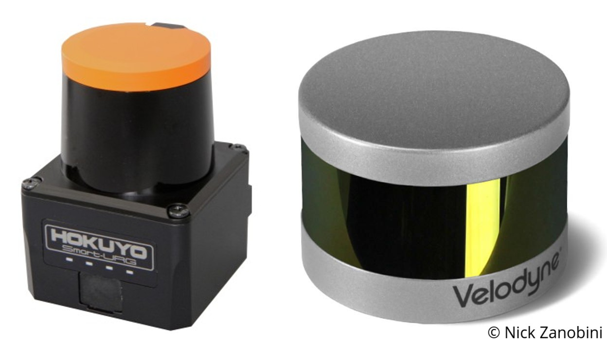
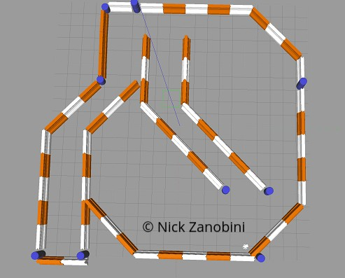
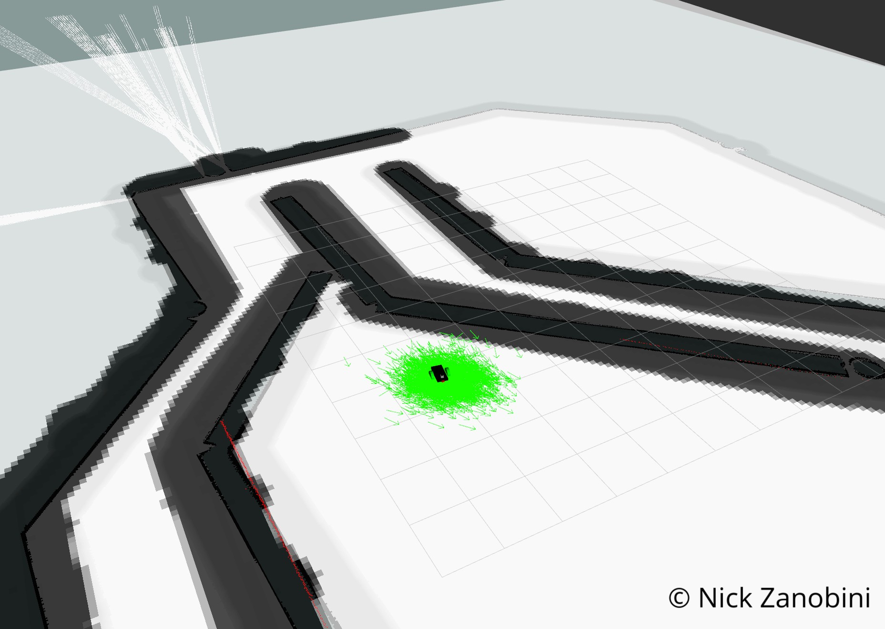
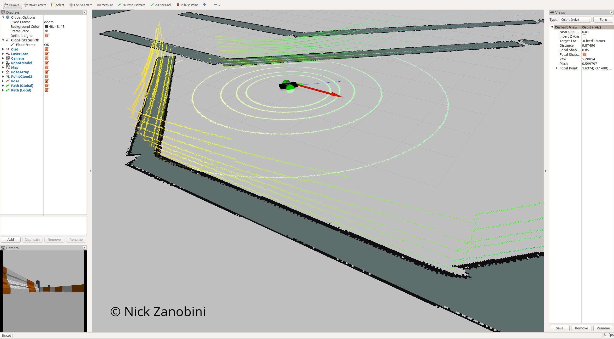

<h2 align="center">RoboND-Localization-Project</h2>
<h3 align="center">Where Am I?</h3>
<h4 align="left">Abstract</h4>
<p>Two different robot models are tested and evaluated in Gazebo and RVIZ utilizing Adaptive Monte Carlo Localization (AMCL) and the move-base plug in for navigation to successfully arrive at a goal that was either pre-determined or user-defined in real time.</p>
<h4 align="left">Introduction</h4>
<p>Autonomous navigation and localization is one of the most challenging tasks we have been tasked to acomplish. In order to do this, several things must happen; the robot must perceive its surroundings and interpret the sensor readings to localize itself. Once the robot has localized itself, or determined its position and pose it can decide on its next action and then continue onto executing that action</p>

<p>In order to do this two different methods were tested: Kalaman Filters (KF) and Monte Carlo Locatization (MCL). 

<p>The Monte Carlo localization algorithm is similar to Kalman Filters because it estimates the posterior distribution of a robot’s position and orientation based on sensory updates but rather than using Gaussians it uses particles to model the robot's state.</p>

<p>MCL solves the local and global localization problems but similar to KF is not suitable for addressing the kidnaped robot problem. This could be solved by resetting the distribution of particles turning the problem from the kidnapped robot problem to a global localization problem, the same as when the robot is initalized.</p>

<p>Based on the performance characterisitcs of Adaptive Monte Carlo Locatlization (AMCL) and its performance benifits over an Extended Kalman Filter(EKF), AMCL was chosen as the desired localization algorithm.</p>

<p>AMCL is a good localization alogrithm for a robot in an envioment that is constantly changing, such as a robotic vacuum or home service robot. Similarily, it would be good for use in a hospital envioment or nursing home where obstacles such as people are constantly changing.</p>

<p>In this paper two different robot models are evauluated with two different LIDAR sensors using Adaptive MCL. With extensive expiramentation various parameters of the alogirthms are used to tune and optimize localization and navigation through the provided maze.</p>

<center></center>
<center></center>

<h4 align="left">Simulation Results</h4>
<p>This project was simulated in Gazebo and RVIZ was used for visualization of the sensor readings, and how the different parameters help the robot localize itself.</p>

<p>To test out this simulation the following commands need to be run in their own terminal windows on an Ubuntu 16.04 LTS System with ROS Kinetic Kame</p>

<h5>Udacity Baseline Model</h5>

```
roslaunch udacity_bot udacity_world.launch
roslaunch udacity_bot amcl.launch
rosrun udacity_bot navigation_goal
```

<center></center>

<h5>Nicks Model</h5>

```
roslaunch nicks_bot udacity_world.launch
roslaunch nicks_bot amcl.launch
rosrun nicks_bot navigation_goal
```

<center></center>

<p>As shown in the images above, both robots were able to reach their goal location. The main difference between the two models is the nicks_bot package uses a Velodyne VLP-16 Lidar. This lidar is very popular commercailly and is commonly found on many self driving cars. The use of this lidar in simulation required the parameters of the map to be greatly reduced as the amount of data recived from the Velodyne Lidar was significantly higher than that of the Hokuyo Lidar. In order to achieve results I felt were acceptable I also had to fine tune the AMCL parameters beyond the defualt values that worked initally for the udacity_bot package.</p>

<h4 align="left">Discussion</h4>

<p>The Velodyne Lidar output a PointCloud2 by default and inorder to not have to change the behavior of the AMCL package the PointCloud2 data had to be converted into a LaserScan. This required settting a z value to average the sensor readings over inorder to determine where to estimate the laserscan at. Additonally I was unable to update the map and the controller as fast because this conversion took a significantly larger amount of processing power.</p>

<p>The main parameters I tuned were decreasing the global and local map size and update frequencies. In the costmap_common_params I adjusted the distance range that the costmap shopuld be updated based on the laser scans inorder to add or remove obstacles. In order to keep the robot from colliding with the walls, I increased the inflation radius and the robot radius. This will help the navigation planner when calculating the global path. Lastly, I tuned the parameters for amcl. I reduced the maximum number of particles to 200 and the minimum to 25 inorder to compensate for the load the Velodyne Lidar was putting on the system as well as helping it converge faster.</p>

<p>The nicks_bot robot clearly takes a more direct path to the goal and the particle filter converges significantly faster. Decreasing the map size increased how fast my computer could simulate the enviroment, but decreased the accuracy of the system. However, due to the decreased frequency the robot is able to update itself they both achieve similar results, reaching the goal location in under five minutes.</p>

<h4 align="left">Future Work</h4>

<p>In the future I think it would be interesting to tune the models to work on a real robot that actually navigated around a maze. Furthermore I would like to rebuild this project using a four wheeled robot and using the move-base package accordingly. I think that the two wheeled robot with two casters to keep it balanced simplifies the problem beyond what is realisitic for real life usage in an unknown or rough terrained enviroment.</p>
